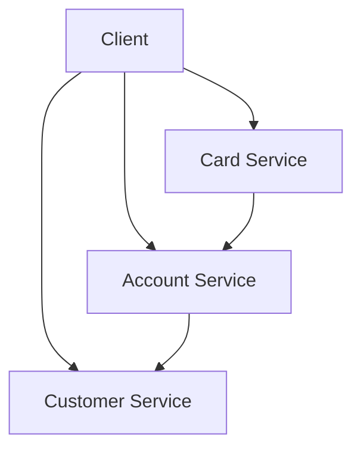

# Banking Platform Microservices Documentation

## Overview
This documentation covers the three microservices that make up the Banking Platform:
1. **Customer Service** - Manages customer data
2. **Account Service** - Manages account data
3. **Card Service** - Manages card data

## API Endpoints

### Customer Service
| Endpoint | Method | Description |
|----------|--------|-------------|
| `/api/customers` | POST | Create a new customer |
| `/api/customers/{id}` | GET | Get customer by ID |
| `/api/customers` | GET | Get all customers (paginated) |

Example Request:
```http
POST /api/customers
Content-Type: application/json

{
    "firstName": "John",
    "lastName": "Doe",
    "otherName": "Michael"
}
```

### Account Service
| Endpoint | Method | Description |
|----------|--------|-------------|
| `/api/accounts` | POST | Create a new account |
| `/api/accounts/{id}` | GET | Get account by ID |
| `/api/accounts` | GET | Get all accounts (paginated) |

### Card Service
| Endpoint | Method | Description |
|----------|--------|-------------|
| `/api/cards` | POST | Create a new card |
| `/api/cards/{id}` | GET | Get card by ID (PAN/CVV masked by default) |
| `/api/cards` | GET | Get all cards (paginated) |

## Data Models

### Customer
```json
{
    "id": 1,
    "firstName": "John",
    "lastName": "Doe",
    "otherName": "Michael",
    "createdAt": "2023-07-20T10:30:00Z"
}
```

### Account
```json
{
    "id": 1,
    "iban": "GB29NWBK60161331926819",
    "bicSwift": "BARCGB22",
    "customerId": 1
}
```

### Card
```json
{
    "id": 1,
    "alias": "My Personal Card",
    "accountId": 1,
    "type": "PHYSICAL",
    "pan": "411111******1111",
    "cvv": "***"
}
```

## Getting Started

### Prerequisites
- Java 17+
- Maven 3.8+
- PostgreSQL
- Docker (optional)

### Installation
1. Clone the repository
2. Build the project:
```bash
mvn clean install
```

3. Start the services:
```bash
docker-compose up --build
```

## Testing
Run tests for all services:
```bash
mvn test
```

## Swagger Documentation
Each service provides interactive API documentation:
- Customer Service: `http://localhost:8081/swagger-ui.html`
- Account Service: `http://localhost:8082/swagger-ui.html`
- Card Service: `http://localhost:8083/swagger-ui.html`

## Deployment
Deploy using Docker:
```bash
docker-compose up -d
```

## Architecture


## Error Handling
Common error responses:
- `400 Bad Request` - Invalid input data
- `404 Not Found` - Resource not found
- `500 Internal Server Error` - Server error